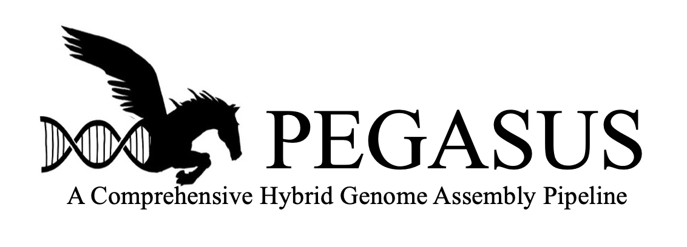
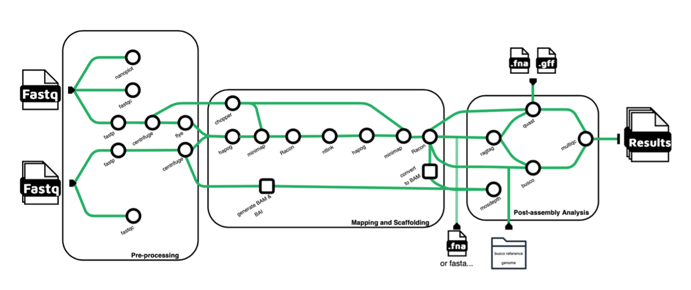
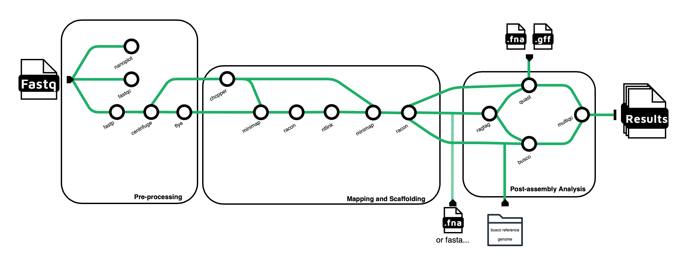

[](https://doi.org/10.5281/zenodo.11397779)

### Authors
James (Jax) Lubkowitz<sup>1</sup>, [Emily Curd](https://scholar.google.com/citations?user=uGHWHbgAAAAJ&hl=en&oi=ao)<sup>2</sup>, [Julie Dragon](https://scholar.google.com/citations?hl=en&user=ZVDbyLsAAAAJ)<sup>2,3</sup>, [Ed Harcourt](https://scholar.google.com/citations?user=x_oZs9IAAAAJ&hl=en&oi=ao)<sup>1</sup>

### Affiliations
1 St. Lawrence University, NY, USA \
2 Vermont Biomedical Research Network, University of Vermont, VT, USA \
3 Department of Microbiology & Molecular Genetics, University of Vermont, VT, USA

### Funding
Research reported in this repository was supported by an Institutional Development Award (IDeA) from the National Institute of General Medical Sciences of the National Institutes of Health under grant number P20GM103449. Its contents are solely the responsibility of the authors and do not necessarily represent the official views of NIGMS or NIH.

### PEGASUS
We introduce PEGASUS, a Pretty Epic Genome Assembly Software Using Sequences, as an all-in-one, user-friendly genome assembly tool that implements hybrid (i.e., using both long and short read sequences) and long-read only assembly methods to produce reliable results. PEGASUS is written in and containerized in Nextflow to ensure reproducible results across environments. In addition to genome assembly, PEGASUS analyzes raw reads to gather statistics, and employs various methods to ensure the quality of the assembled genome allowing for a comprehensive process. PEGASUS also provides a reference genome scaffolding, which allows for high-quality genome assemblies across multiple individuals without requiring extensive read depth (if a suitable reference genome is available). This approach yields significant advantages in terms of reducing sequencing costs, assembly runtime, and computational power needed when building many genomes of the same species.

### Hyrbid Pipeline

Pegasus is a hybrid genome assembly tool that uses long and short reads. Prior to assembly, read quality is assessed using Nanoplot and FastQC, followed by the trimming of short-reads and long-reads with Fastp. Subsequently, all reads undergo the removal of extraneous human, prokaryotic, or viral components through Centrifuge. Long-reads are initial denoted into contigs via Flye before entering a polishing phase (with both short and then long reads with Hapo-g and Racon respectively). The polished contigs are then re-scaffolded to the initial long reads via Ntlink. This is then re-polished again with both sets of reads producing a read-only genome build. Furthermore, this genome is scaffolded onto a user-specified reference genome with ragtag for an additional mapped genome. Both the read-only genome and the reference-scaffolded genome undergo Busco, Quast and Mosdepth processes to assess genome quality and read depth.

### Long-read only Pipeline

The long-read only pipeline follows a similar structure to the hybrid process. Prior to assembly, read quality is assessed using Nanoplot and FastQC, followed by the trimming of long-reads with Fastp. Subsequently, all reads undergo the removal of extraneous human, prokaryotic, or viral components through Centrifuge. Long-reads are initial denoted into contigs via Flye before entering a polishing phase with Racon. The polished contigs are then re-scaffolded to the initial long reads via Ntlink. This is then re-polished again with the long-reads producing a read-only genome build. Furthermore, this genome is scaffolded onto a user-specified reference genome with ragtag for an additional mapped genome. Both the read-only genome and the reference-scaffolded genome undergo Busco and Quast processes to assess genome quality.

### Usage
Software requirements: [Singularity](https://docs.sylabs.io/guides/3.0/user-guide/installation.html) and [Nextflow](https://www.nextflow.io/docs/latest/getstarted.html)

#### Installing from Github
```
git clone https://github.com/jaxlub/PEGASUS
```

#### Parameters

##### Hybrid Pipeline
```
pegasus.sh -n <Path to long reads>
            -s1 <Path to batch 1 of short reads>
            -phv <Path to PHV indexes>
            -qg <Path to Quast .gff reference>
            -qf <Path to Qaust .fna reference>
            -b <Path to Busco reference>
            -r <Path to reference genome for ragtag scaffolding>
            -t <Number of threads>
```

##### Long-read Pipeline
```
pegasus.sh -n <Path to long reads>
            -phv <Path to PHV indexes>
            -qg <Path to Quast .gff reference>
            -qf <Path to Qaust .fna reference>
            -b <Path to Busco reference>
            -r <Path to reference genome for ragtag scaffolding>
            -t <Number of threads>
```
For effective implementation PEGASUS requires:
- Long Read Sequences
- Short Read Sequences (not needed for long-read pipeline)
- [PHV indexes](https://ccb.jhu.edu/software/centrifuge/manual.shtml): PHV indexes for identification and removal of contaminate sequences via Centrifuge.
- Quast reference: Quast reference is required for assessing the quality of the assembly (both .gff & .fna files).
- [Busco reference](https://busco.ezlab.org/busco_userguide.html#lineage-datasets): A Busco reference is necessary for comparative genomics analysis.
- Reference genome: A reference genome for ragtag alignment. 
- Number of threads to run all processes on. 

For optimal results, it is recommended that the three references mentioned above are closely related to the genome being assembled. This ensures greater accuracy in assembly and metrics evaluation. 

#### Example Usage
```
pegasus.sh \
            -n '/users/j/l/jlubkowi/scratch/bullhead_project/Catfish/BS1/reads/long_reads/BS1_nanopore_raw_backup.fastq.gz' \
            -s1 '/users/j/l/jlubkowi/scratch/bullhead_project/Catfish/BS1/reads/short_reads1'\
            -phv '/users/j/l/jlubkowi/scratch/PHVindexes'\
            -qg '/users/j/l/jlubkowi/scratch/bullhead_project/Ameiurus_melas_genome/GCA_012411365.1_AMELA_1.0_genomic.gff' \
            -qf '/users/j/l/jlubkowi/scratch/bullhead_project/Ameiurus_melas_genome/GCA_012411365.1_AMELA_1.0_genomic.fna' \
            -b '/gpfs1/home/e/g/eguswa/scratch/bullhead/actinopterygii_odb10' \
            -r '/users/j/l/jlubkowi/scratch/bullhead_project/Catfish/HL4RefGen.fasta' \
            -t '16'
```

### Software Versions
| Tool          | Version | Description                                |
|---------------|---------|--------------------------------------------|
| Nanoplot      | 1.41.0  | Long read analysis tool                    |
| FastQC        | 0.11.9  | Long and short read analysis tool          |
| Fastp         | 0.23.4  | Adapter removal tool for all reads         |
| Centrifuge    | 1.0.4   | Identify contaminant reads in sample       |
| R-Tidyverse   | 3A1.2.1 | Used to select non-contaminated reads w/ Centrifuge |
| Seqtk         | 1.3     | Used to edit genomic file formatting       |
| Flye          | 2.9     | Long read genome assembly tool             |
| Hapo-g        | 1.3.7   | Short read genome polishing tool           |
| Chopper       | 0.7.0   | Quality read filter tool                   |
| Minimap2      | 2.26    | Long read alignment tool                   |
| Racon         | 1.5.0   | Long read genome polishing tool            |
| Ntlink        | 1.3.9   | Long read scaffolding tool                 |
| Ragtag        | 2.1.0   | Reference genome scaffolding tool          |
| Quast         | 5.2.0   | Genome assembly analysis tool              |
| Busco         | 5.5.0   | Genome assembly analysis tool              |
| Bwa-mem2      | 2.2.1   | Used to convert file types                 |
| Mosdepth      | 0.3.6   | Short read depth tool                      |
| Multiqc       | 1.14    | Used to generate final HTML report         |

### Output 
Pipeline outputs all notable results to the `Results` directory. All intermediate information and files are stored in the Nextflow `work` directory.

Most Notable Results:
- Final read-only assembled genome is located in `Racon2`
- Ragtagged genome is located in `Ragtag`
- Long read depth is located in `Flye`
- Various assemble metrics are located in `MultiQC`

#### Published Results Directory Structure
```
Results
    -- Busco
        -- busco_genome
            -- Contains Busco results of hapog-built genome
        -- busco_ragtag
            -- Contains Busco results of ragtag-scaffolded genome
    -- Fastp_long
            -- Adapterless long reads
    -- FastQC
        -- Contains FastQC zip and html files
    -- Flye
        -- flye
            -- Contains assembly.fasta, an intermediate genome
        -- contig_stats.txt, contians long read coverage
    -- Hapog1
          -- Contains hapog.fasta an intermediate genome
    -- Hapog2
        -- Contains hapog.fasta an intermediate genome
    -- long_centrifuge
        -- Contains cleaned longreads in fastq.gz
    -- Mosdepth
        -- Contains mosdepth result files
    -- MultiQC
        -- MultiQC report
    -- Nanoplot
        -- Contains Nanoplot png and html files
    -- quast_results
        -- results from read-only genome Quast
    -- NTLink
        -- Contains hapog_result.fasta.k32.w250.z1000.ntLink.5rounds.fa, an intermediate genome
    -- RagTag
        -- Contains all ragtag results
    -- Racon2
        -- final genome from read-assembly
    -- ragtag_quast_results
         -- results from Ragtag genome Quast
    -- short_centrifuge
        -- short_centrifuge_results
            -- Contains cleaned shortreads in fastq.gz
        -- short read centrifuge stats
    -- trimmed_short_reads
        -- Fastp adapterless short reads
``` 

### Development
Pegasus was developed using oxford nanopore long reads and illumina/singularity short reads. Jobs were submitted to 1 node with 40-80 CPUs and 128-256GB of memory for 100 hours (though often finished before this). 

## For further documention see the attached PEGASUS paper

## References
#### Busco
- Mosè Manni, Matthew R Berkeley, Mathieu Seppey, Felipe A Simão, Evgeny M Zdobnov, BUSCO Update: Novel and Streamlined Workflows along with Broader and Deeper Phylogenetic Coverage for Scoring of Eukaryotic, Prokaryotic, and Viral Genomes. Molecular Biology and Evolution, Volume 38, Issue 10, October 2021, Pages 4647–4654

 - Manni, M., Berkeley, M. R., Seppey, M., & Zdobnov, E. M. (2021). BUSCO: Assessing genomic data quality and beyond. Current Protocols, 1, e323. doi: 10.1002/cpz1.323

#### bwa-mem2
- Vasimuddin Md, Sanchit Misra, Heng Li, Srinivas Aluru. Efficient Architecture-Aware Acceleration of BWA-MEM for Multicore Systems. IEEE Parallel and Distributed Processing Symposium (IPDPS), 2019. 10.1109/IPDPS.2019.00041

#### Centrifuge
 - Kim D, Song L, Breitwieser FP, and Salzberg SL. Centrifuge: rapid and sensitive classification of metagenomic sequences. Genome Research 2016
 http://ccb.jhu.edu/software/centrifuge/

 #### Chopper
- De Coster, W. Rademakers, R. NanoPack2: population-scale evaluation of long-read sequencing data, Bioinformatics, Volume 39, Issue 5, May 2023, btad311, https://doi.org/10.1093/bioinformatics/btad311

#### FastQC
- Andrews S: FastQC: a quality control tool for high throughput sequence data.2010. https://www.bioinformatics.babraham.ac.uk/projects/fastqc/ \
Data accessed: 12/6/2023

#### Fastp
- Shifu Chen. 2023. Ultrafast one-pass FASTQ data preprocessing, quality control, and deduplication using fastp. iMeta 2: e107. https://doi.org/10.1002/imt2.107

#### Flye
- Yu Lin, Jeffrey Yuan, Mikhail Kolmogorov, Max W Shen, Mark Chaisson and Pavel Pevzner, "Assembly of Long Error-Prone Reads Using de Bruijn Graphs", PNAS, 2016 doi:10.1073/pnas.1604560113

##### Hapo-G
 - Jean-Marc Aury, Benjamin Istace, Hapo-G, haplotype-aware polishing of genome assemblies with accurate reads, NAR Genomics and Bioinformatics, Volume 3, Issue 2, June 2021, lqab034, https://doi.org/10.1093/nargab/lqab034

#### Minimap2
- Li, H. (2018). Minimap2: pairwise alignment for nucleotide sequences. Bioinformatics, 34:3094-3100. doi:10.1093/bioinformatics/bty191

#### Mosdepth
- Brent S Pedersen, Aaron R Quinlan, Mosdepth: quick coverage calculation for genomes and exomes, Bioinformatics, Volume 34, Issue 5, March 2018, Pages 867–868, https://doi.org/10.1093/bioinformatics/btx699

#### MultiQC
- Philip Ewels, Måns Magnusson, Sverker Lundin, Max Käller, MultiQC: summarize analysis results for multiple tools and samples in a single report, Bioinformatics, Volume 32, Issue 19, October 2016, Pages 3047–3048, https://doi.org/10.1093/bioinformatics/btw354

#### Nanoplot
- Wouter De Coster, Rosa Rademakers, NanoPack2: population-scale evaluation of long-read sequencing data, Bioinformatics, Volume 39, Issue 5, May 2023, btad311, https://doi.org/10.1093/bioinformatics/btad311

#### Ntlink
- Coombe L, Li JX, Lo T, Wong J, Nikolic V, Warren RL and Birol I. LongStitch: High-quality genome assembly correction and scaffolding using long reads. bioRxiv. 2021;2021.06.17.448848. doi: https://doi.org/10.1101/2021.06.17.448848

#### Quast
- Alexey Gurevich, Vladislav Saveliev, Nikolay Vyahhi, Glenn Tesler, QUAST: quality assessment tool for genome assemblies, Bioinformatics, Volume 29, Issue 8, April 2013, Pages 1072–1075, https://doi.org/10.1093/bioinformatics/btt086

#### R & Tidyverse
- R Core Team (2021). R: A language and environment for statistical computing. R Foundation for Statistical Computing, Vienna, Austria. https://www.R-project.org/.
- Wickham H, Averick M, Bryan J, Chang W, McGowan LD, François R, Grolemund G, Hayes A, Henry L, Hester J, Kuhn M, Pedersen TL, Miller E, Bache SM, Müller K, Ooms J, Robinson D, Seidel DP, Spinu V, Takahashi K, Vaughan D, Wilke C, Woo K, Yutani H (2019). “Welcome to the tidyverse.” Journal of Open Source Software, 4(43), 1686. doi:10.21105/joss.01686.

#### Racon
- R. Vaser, I. Sović, N. Nagarajan, M. Šikić, Fast and accurate de novo genome assembly from long uncorrected reads. Genome Res. 27, 737–746 (2017).

#### Ragtag
- Alonge, Michael, et al. "Automated assembly scaffolding elevates a new tomato system for high-throughput genome editing." Genome Biology (2022). 
https://doi.org/10.1186/s13059-022-02823-7

#### Samtools
Twelve years of SAMtools and BCFtools 
Petr Danecek, James K Bonfield, Jennifer Liddle, John Marshall, Valeriu Ohan, Martin O Pollard, Andrew Whitwham, Thomas Keane, Shane A McCarthy, Robert M Davies, Heng Li 
GigaScience, Volume 10, Issue 2, February 2021, giab008, https://doi.org/10.1093/gigascience/giab008

#### Seqtk
- H. Li, Seqtk: a fast and lightweight tool for processing FASTA or FASTQ sequences, 2013. https://github.com/lh3/seqtk

### Containers
All containers come from https://depot.galaxyproject.org/singularity/
https://galaxyproject.org/citing-galaxy/

- The Galaxy Community. The Galaxy platform for accessible, reproducible and collaborative biomedical analyses: 2022 update, Nucleic Acids Research, Volume 50, Issue W1, 5 July 2022, Pages W345–W351, doi:10.1093/nar/gkac247


