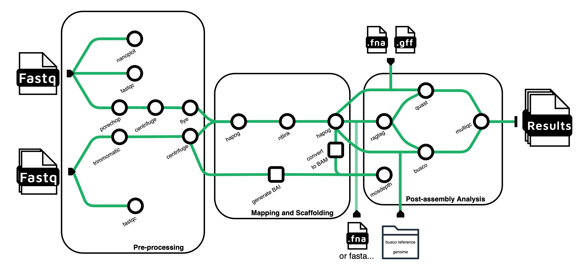

### Authors
James (Jax) Lubkowitz<sup>1,2</sup>, [Emily Curd](https://scholar.google.com/citations?user=uGHWHbgAAAAJ&hl=en&oi=ao)<sup>2</sup>, [Julie Dragon](https://scholar.google.com/citations?hl=en&user=ZVDbyLsAAAAJ)<sup>2</sup>, [Ed Harcourt](https://scholar.google.com/citations?user=x_oZs9IAAAAJ&hl=en&oi=ao)<sup>1</sup>

### Affiliations
[Vermont Biomedical Research Network](https://vbrn.org), [Vermont Integrated Genomics Resource](https://www.med.uvm.edu/vigr/home), [University of Vermont](https://www.uvm.edu), [St. Lawrence University](https://www.stlawu.edu)

### Funding
Research reported in this repository was supported by an Institutional Development Award (IDeA) from the National Institute of General Medical Sciences of the National Institutes of Health under grant number P20GM103449. Its contents are solely the responsibility of the authors and do not necessarily represent the official views of NIGMS or NIH.


### Pipeline Process



Pegasus is a Hybrid Genome Assembly Tool using long and short-reads. Prior to assembly, read quality is assessed using Nanoplot and FastQC, followed by the trimming of short-reads and long-reads. Subsequently, all reads undergo the removal of extraneous human, prokaryotic, or viral components through Centrifuge. Long-reads are initial denoted into contigs via Flye before entering Hapo-G where the contigs are polished with short-reads. The polished contigs are then re-scaffolded to the initial long-reads via NtLink. This is then polished again with Hapo-G and is output as an assembled genome in ```Results/.../Hapog2/hapog.fasta```. Furthermore, this genome is scaffolded onto an input genome, ideally of the same species or close relative, for a further mapped genome in ```Results/.../ragtag.scaffold.fasta```. Both the Hapo-G-refined genome and the Ragtag-scaffolded genome undergo Busco, Quast and Mosdepth processes to assess genome quality and read depth.


### Installation and Depedencies
This pipeline requires Singularity and Nextflow.
- [Nextflow Installation](https://www.nextflow.io/docs/latest/getstarted.html)


Once depedencies are completed 
```
git clone https://github.com/jaxlub/PEGASUS
```


Singularity must loaded before every run or resume of the pipeline process
```module load singularity```


look into adding it to PATH/Executable
Jump to Example usage


### Parameters
- nanoPath: path to directory containing nanopore longreads
- shortPath1 path to directory containing first batch of shortreads
- shortpath2: path to directory containing second batch of shortreads
- quastPathGFF: path to GFF genome for comparison 
- quastPathFNA: path to FNA genome for comparison 
- buscoPath: Path to reference genome for Busco comparison
- ref1: Path to reference genome for ragtag assembly

### Example Usage
```
nextflow run  /users/j/l/jlubkowi/scratch/bullhead_project/HL4/main.nf -resume \
            --nanoPath '/users/j/l/jlubkowi/scratch/bullhead_project/HL4/reads/long_reads/*' \
            --shortPath1 '/users/j/l/jlubkowi/scratch/bullhead_project/HL4/reads/short_reads1/*' \
            --shortPath2 '/users/j/l/jlubkowi/scratch/bullhead_project/HL4/reads/short_reads2/*' \
            --quastPathGFF '/users/j/l/jlubkowi/scratch/bullhead_project/Ameiurus_melas_genome/GCA_012411365.1_AMELA_1.0_genomic.gff' \
            --quastPathFNA '/users/j/l/jlubkowi/scratch/bullhead_project/Ameiurus_melas_genome/GCA_012411365.1_AMELA_1.0_genomic.fna' \
            --buscoPath '/gpfs1/home/e/g/eguswa/scratch/bullhead/actinopterygii_odb10' \
            --ref1 '/users/j/l/jlubkowi/scratch/bullhead_project/Ameiurus_melas_genome/GCA_012411365.1_AMELA_1.0_genomic.fna' 
```


# Jaxs Notes  -
Developed only with nanopore long reads and illumina and singular shortreads. 


# TODO 
- do we need parameter to specify illumina vs singular shortreads when trimming.... 
- MIT Liscence 
- Clean up publish dir... dont need so many nested dirs.
    - update results section of readme
- DOI on https://zenodo.org
- citations and documentation
- how to do multiqc of not the entire work dir..... 
    bug in multiqc
- unhardcode R file and PHV indexes... ask Ed about adding hole package to path and best practices?
- Ask Emily about numbering superscript on authors

### Output 
Pipeline outputs all notable results to a Results directory. 
All intermediate information and files are stored in the nextflow work directories.

Published Results Directory Structure
```
Results
    -- Busco
        -- busco_genome
            -- Contains Busco results of hapog-built genome
        -- busco_ragtag
            -- Contains Busco results of ragtag-scaffolded genome
    -- FastQC
        -- Contains FastQC zip and html files
    -- Flye
        -- flye
            -- Contains assembly.fasta, an intermediate genome
    -- Hapog1
        -- polishing
            -- hapog
                -- Contains hapog.fasta an intermediate genome
    -- Hapog2
        -- polishing
            -- hapog
                -- Contains hapog.fasta an intermediate genome
    -- long_centrifuge
        -- Contains cleaned longreads in fastq.gz
    -- Mosdepth
        -- Contains mosdepth result files
    -- Nanoplot
        -- Contains Nanoplot png and html files
    -- NTLink
        -- Contains hapog_result.fasta.k32.w250.z1000.ntLink.5rounds.fa, an intermediate genome
    -- RagTag
        -- ragtag_results
            -- Contains all ragtag results
    -- short_centrifuge
        -- short_centrifuge_results
            -- Contains cleaned shortreads in fastq.gz
    -- Trimmomatic
        -- trimmomatic
            -- Contains trimmed and untrimmed shortreads
``` 


### Trouble Shooting
- Error "root filesystem extraction failed":
    ```
    Command error:
  INFO:    Converting SIF file to temporary sandbox...
  FATAL:   while extracting /gpfs2/scratch/jlubkowi/bullhead_project/HL42.0/work/singularity/depot.galaxyproject.org-singularity-ntlink-1.3.9--py39hd65a603_2.img: root filesystem extraction failed: extract command failed: ERROR  : Failed to create user namespace: user namespace disabled
  : exit status 1
    ```

    Before resuming run ```module load singularity``` and then resume run of pipeline. 


### Development
Pegasus was developed using oxford nanopore long reads and illumina/singularity shortreads. Jobs were submitted to 1 node with 40-80 CPUs and 128-256GB of memory for 100 hours (though often finished before this). 


## References and Tool Citations

Still to reference Amerisu Melas genome...?

### Tools
#### Porechop
- Porechop_ABI: discovering unknown adapters in ONT sequencing reads for downstream trimming
Quentin Bonenfant, Laurent Noé, Hélène Touzet
bioRxiv 2022.07.07.499093; doi: https://doi.org/10.1101/2022.07.07.499093
#### Busco
- Mosè Manni, Matthew R Berkeley, Mathieu Seppey, Felipe A Simão, Evgeny M Zdobnov, BUSCO Update: Novel and Streamlined Workflows along with Broader and Deeper Phylogenetic Coverage for Scoring of Eukaryotic, Prokaryotic, and Viral Genomes. Molecular Biology and Evolution, Volume 38, Issue 10, October 2021, Pages 4647–4654

 - Manni, M., Berkeley, M. R., Seppey, M., & Zdobnov, E. M. (2021). BUSCO: Assessing genomic data quality and beyond. Current Protocols, 1, e323. doi: 10.1002/cpz1.323

#### Centrifuge
 - Kim D, Song L, Breitwieser FP, and Salzberg SL. Centrifuge: rapid and sensitive classification of metagenomic sequences. Genome Research 2016 \
 http://ccb.jhu.edu/software/centrifuge/

#### FastQC
- Andrews S: FastQC: a quality control tool for high throughput sequence data.2010. https://www.bioinformatics.babraham.ac.uk/projects/fastqc/ \
Data accessed: 12/6/2023

#### Flye
- Yu Lin, Jeffrey Yuan, Mikhail Kolmogorov, Max W Shen, Mark Chaisson and Pavel Pevzner, "Assembly of Long Error-Prone Reads Using de Bruijn Graphs", PNAS, 2016 doi:10.1073/pnas.1604560113

##### Hapo-G
 - Jean-Marc Aury, Benjamin Istace, Hapo-G, haplotype-aware polishing of genome assemblies with accurate reads, NAR Genomics and Bioinformatics, Volume 3, Issue 2, June 2021, lqab034, https://doi.org/10.1093/nargab/lqab034

#### MultiQC
- Philip Ewels, Måns Magnusson, Sverker Lundin, Max Käller, MultiQC: summarize analysis results for multiple tools and samples in a single report, Bioinformatics, Volume 32, Issue 19, October 2016, Pages 3047–3048, https://doi.org/10.1093/bioinformatics/btw354

#### Ntlink
- Coombe L, Li JX, Lo T, Wong J, Nikolic V, Warren RL and Birol I. LongStitch: High-quality genome assembly correction and scaffolding using long reads. bioRxiv. 2021;2021.06.17.448848. doi: https://doi.org/10.1101/2021.06.17.448848

#### Trimmomatic
- Anthony M. Bolger, Marc Lohse, Bjoern Usadel, Trimmomatic: a flexible trimmer for Illumina sequence data, Bioinformatics, Volume 30, Issue 15, August 2014, Pages 2114–2120, https://doi.org/10.1093/bioinformatics/btu170

#### Ragtag
- Alonge, Michael, et al. "Automated assembly scaffolding elevates a new tomato system for high-throughput genome editing." Genome Biology (2022). 
https://doi.org/10.1186/s13059-022-02823-7

#### Quast
- Alexey Gurevich, Vladislav Saveliev, Nikolay Vyahhi, Glenn Tesler, QUAST: quality assessment tool for genome assemblies, Bioinformatics, Volume 29, Issue 8, April 2013, Pages 1072–1075, https://doi.org/10.1093/bioinformatics/btt086

### Containers
All containers come from https://depot.galaxyproject.org/singularity/
https://galaxyproject.org/citing-galaxy/

- The Galaxy Community. The Galaxy platform for accessible, reproducible and collaborative biomedical analyses: 2022 update, Nucleic Acids Research, Volume 50, Issue W1, 5 July 2022, Pages W345–W351, doi:10.1093/nar/gkac247


